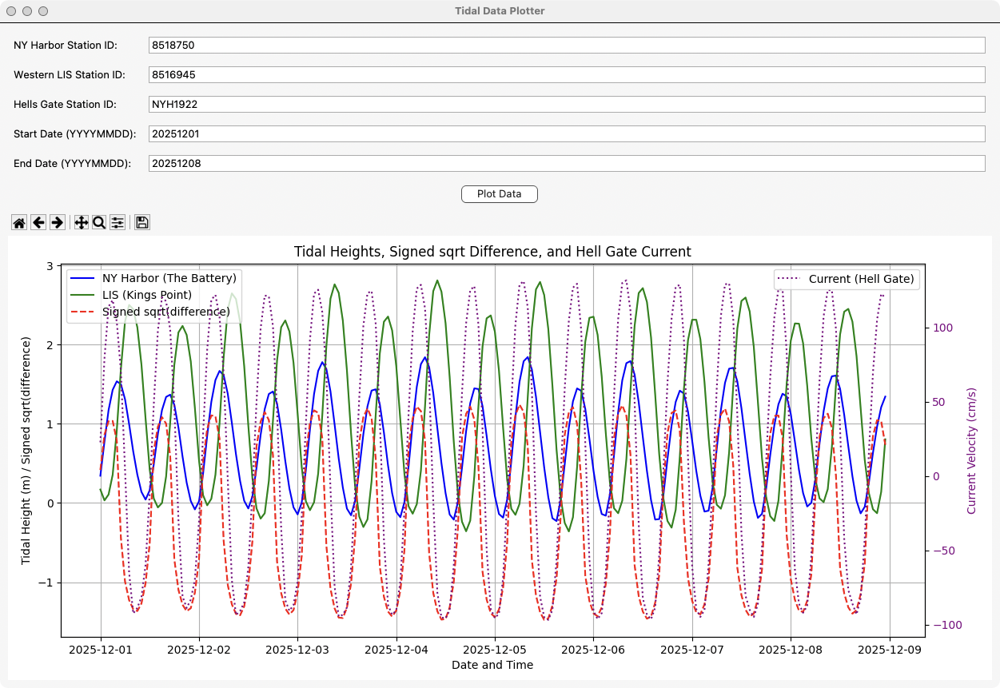

# Tides v1.5
## Tidal Analysis and Visualization Tool

A sophisticated Python application for analyzing and visualizing tidal data from New York Harbor (The Battery) and Western Long Island Sound (Kings Point), with integrated current velocity data from Hell Gate.



## Features

- **Real-time Tidal Data**: Fetches and processes live tidal height data
- **Current Velocity Analysis**: Integrates Hell Gate current velocity data
- **Interactive GUI**: User-friendly interface for data visualization
- **Advanced Plotting**: Displays tidal heights and current velocities with dual-axis visualization
- **Data Processing**: Calculates signed square root of tidal height differences

## Installation

### Prerequisites
- Python 3.x
- pip (Python package installer)

### Setup

1. Clone the repository:
```bash
git clone https://github.com/hiddenhidden/Tides.git
cd Tides
```

2. Install required dependencies:
```bash
pip install -r requirements.txt
```

## Usage

### GUI Application
Run the graphical interface:
```bash
python tide_gui_app.py
```

### Command Line Interface
For command-line plotting:
```bash
python plot.py
```

## Dependencies

- matplotlib >= 3.7.1
- pandas >= 2.0.0
- numpy >= 1.24.0
- requests >= 2.31.0

## Build

To build the standalone application:
```bash
python setup.py build
```

## Project Structure

- `tide_gui_app.py`: Main GUI application
- `plot.py`: Core plotting functionality
- `setup.py`: Build configuration
- `requirements.txt`: Project dependencies
- `icon.icns`: Application icon (macOS)
- `TidePlotsIcon.png`: Project icon

## Version History

- v1.5: Current stable release with GUI improvements and enhanced plotting capabilities

## License

This project is proprietary software. All rights reserved.

## Acknowledgments

Special thanks to NOAA for providing tidal and current data through their APIs. 

## Future Goals

### Expanded Station Support
- Integration with Canadian Hydrographic Service (CHS) stations
- Support for Lubec Channel region:
  - Currently accessible via NOAA's Eastport, ME station (ID: 8410140)
  - Future direct support for CHS Station data (e.g., Lubec - North Entrance, Station Code: 00016)
  - Potential integration with additional data sources like US Harbors

**Note for Lubec Channel Users:** Currently, the best way to monitor Lubec Channel conditions is to use the Eastport, ME station (NOAA Station ID: 8410140), located approximately 6 miles west of Lubec. This station provides representative tidal conditions for the area and is fully compatible with the current version of the application. 